## 服务器配置 **Publish over SSH**

#### 部署服务器 password

name: test1_172.16.192.143 //部署打包选择服务

hostname: 172.16.192.143    //远程服务器的IP

username: admin                    //远程服务器用户名

remote directory: /opt/app    //远程服务部署目录

password: xxx                           //远程服务器密码

port: 22                                       //远程登录端口

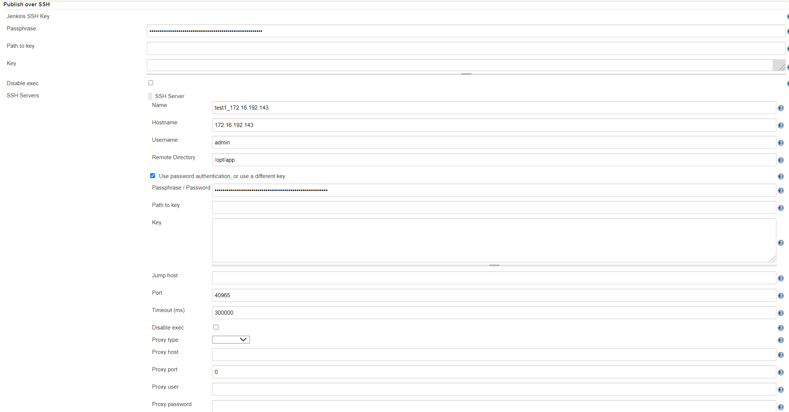

#### 部署服务器 key

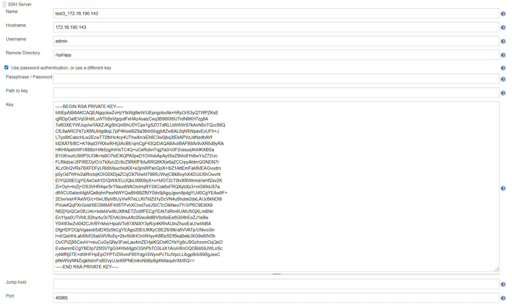


## 全局工具配置

#### Maven 配置

jenkins中安装maven

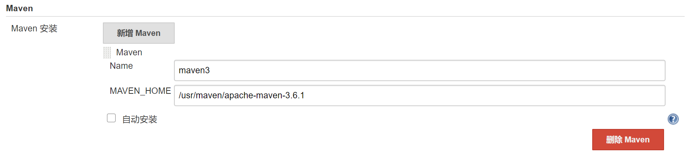

#### nodejs

jenkins中安装nodejs

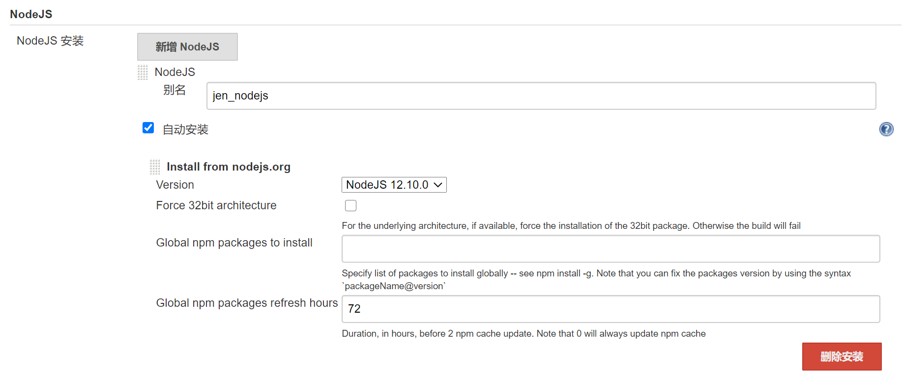

#### jdk配置

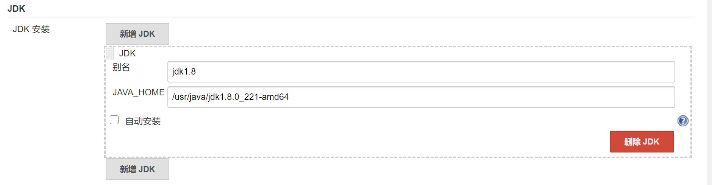

#### git配置

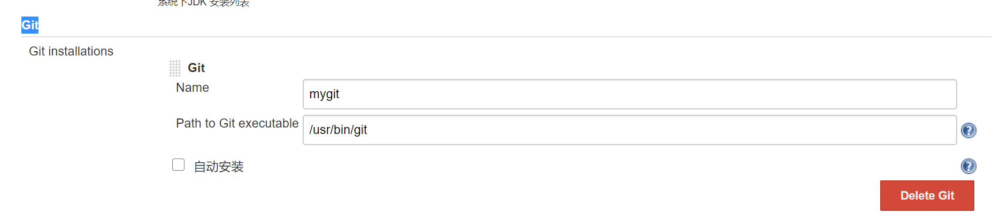


## 配置权限 **Manage and Assign Roles**

#### 角色管理 Manage roles

全局角色这里分为 admin、 test 看着打勾

项目角色 project roles ,分为 测试 test_  、pre_  、online_

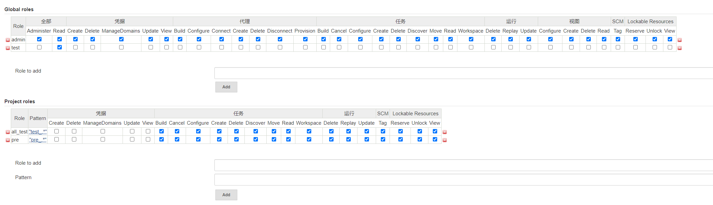

部署名称  test_ 开头

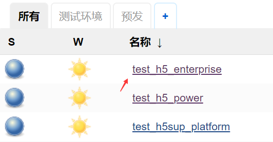


#### 分配角色Assign Roles

全局角色(全局角色添加用户)

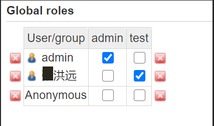

item角色 （项目角色添加用户）

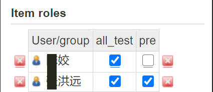


## H5部署


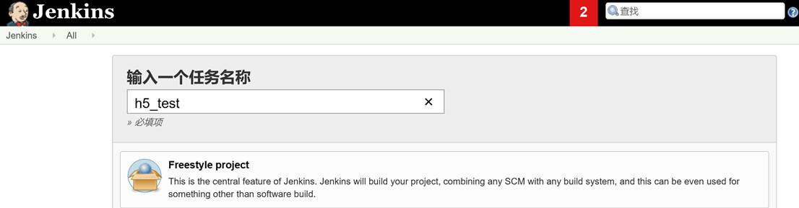

 

 

 

#### 源码

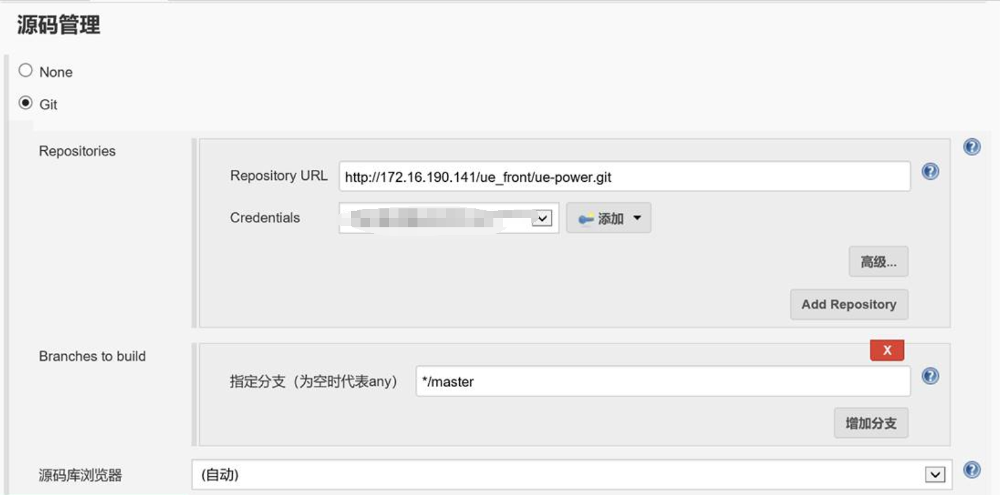

#### 构建环境

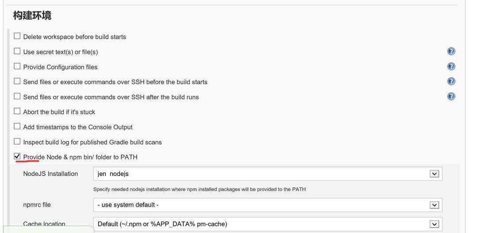

 

#### 构建

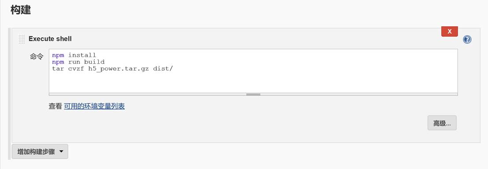

#### 构建后

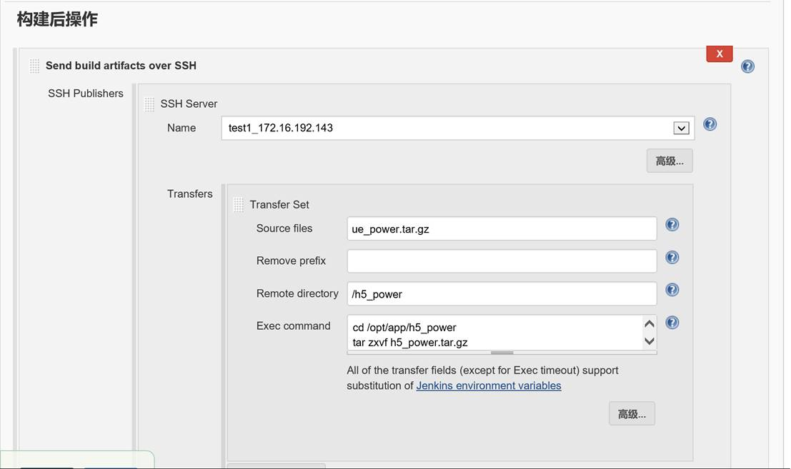


## springboot部署

#### 新建项目

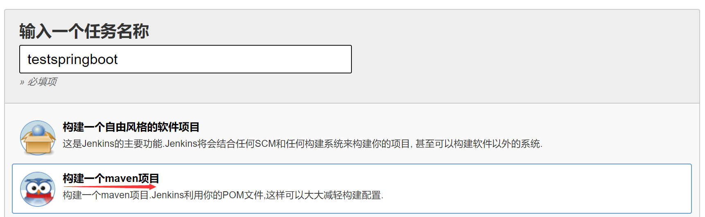

#### 一般设置

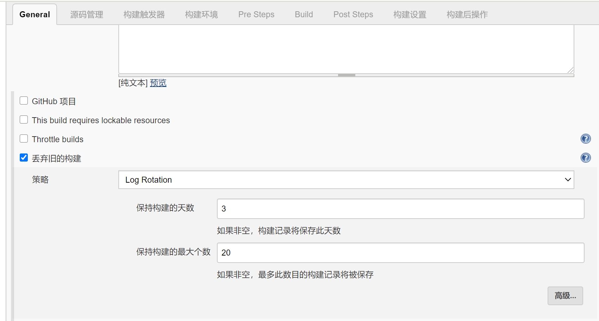

#### 码源设置

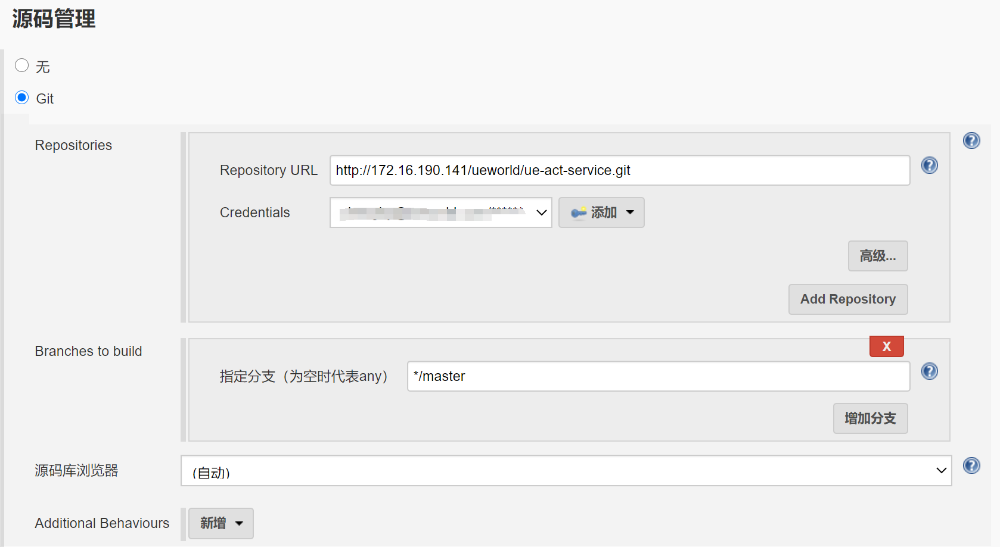

#### 打包设置

清除部署包，重新打包

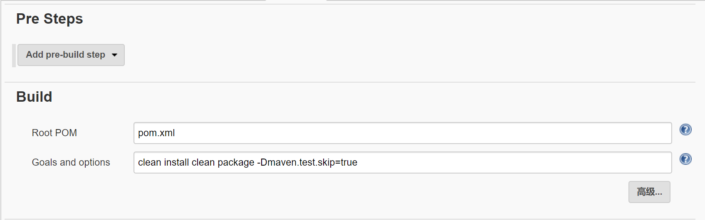

#### 构建后操作

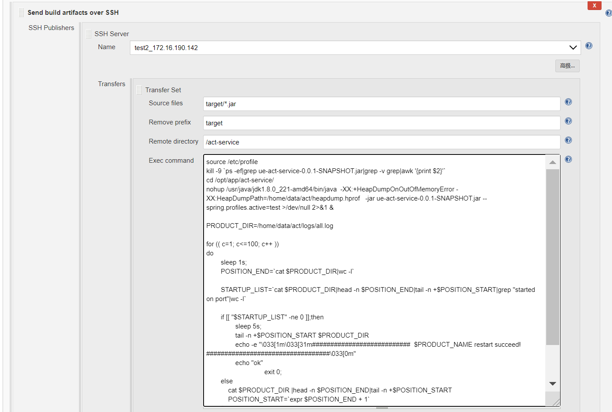

脚本

```
source /etc/profile
kill -9 `ps -ef|grep ue-act-service-0.0.1-SNAPSHOT.jar|grep -v grep|awk '{print $2}'`
cd /opt/app/act-service/
nohup /usr/java/jdk1.8.0_221-amd64/bin/java  -XX:+HeapDumpOnOutOfMemoryError -XX:HeapDumpPath=/home/data/act/heapdump.hprof   -jar ue-act-service-0.0.1-SNAPSHOT.jar --spring.profiles.active=test >/dev/null 2>&1 &

PRODUCT_DIR=/home/data/act/logs/all.log

for (( c=1; c<=100; c++ ))
do
        sleep 1s;
        POSITION_END=`cat $PRODUCT_DIR|wc -l`

        STARTUP_LIST=`cat $PRODUCT_DIR|head -n $POSITION_END|tail -n +$POSITION_START|grep "started on port"|wc -l`

        if [[ "$STARTUP_LIST" -ne 0 ]];then
                sleep 5s;
                tail -n +$POSITION_START $PRODUCT_DIR
                echo -e "\033[1m\033[31m###########################  $PRODUCT_NAME restart succeed! ##################################\033[0m"
                echo "ok"
                                exit 0;
        else
            cat $PRODUCT_DIR |head -n $POSITION_END|tail -n +$POSITION_START
            POSITION_START=`expr $POSITION_END + 1`
        fi
done

echo -e "\033[1m\033[31m######################  $PRODUCT_NAME restart failed(time out) ########################################\033[0m"
```

