## CSS3

### 选择器

.class   选择 class="myclass" 的所有元素。class="class1 class2" class1公共样式 class2特定样式（样式叠加），如class2的样式与	             class1一样直接覆盖class1。

#id      选择 id="myclass" 的所有元素

\*        选择所有元素。

div,p  <div> 元素和<p>元素

```div,p{
div,p{
    border: 2px solid #000; //边框2像数
}
```


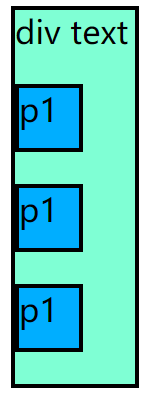

div p  <div>元素内部的所有<p> 

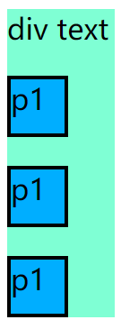

div>p 父元素为 <div> 的所有 <p>


div+p 选择紧接在 <div> 元素之后的所有 <p> 元素

```
div+p{
    border: 2px solid #000;
}
    <p>top</p>
    <div id="div1">
        div text
        <p>p1</p>
        <p>p1</p>
        <p>p1</p>
    </div>
    <p>next</p>
    <p>end</p>
```

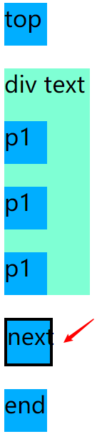

:first-letter	元素首个字母
:first-line       元素首行

p:first-child

 选择属于父元素的第一个子元素的每个 <p> 元素。

```
p:first-child{
    background-color: blueviolet;
}
```


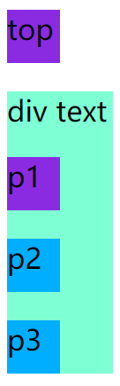

body 的第一个<p>子元素top ,div 的第一个元素 P1。


p~ul 为所有相同的父元素中位于 p 元素之后的所有 ul 元素设置背景

```
p~ul{ background-color: blue;}
 <div>
 <p>p1</p>
  <ul>
   <li>li</li>
   <li>li2</li>
   </ul>
  <p>p2</p>
   <ul>
      <li>li</li>
 </ul>
 </div>
```


:nth-child(n)	p:nth-child(2)	选择属于其父元素的第二个子元素的每个 <p> 元素。	

```
 p:nth-child(2){
        background:red;
 }
 
 <div>
        <p>p1</p>
        <ul>
            <li>li</li>
            <li>li2</li>
        </ul>
        <p>p2</p>
        <ul>
            <li>li</li>
        </ul>
    </div>
    <p>top</p>
    <div id="div1">
        div text
        <p>p1</p>
        <p>p2</p>
        <p>p3</p>
    </div>
```

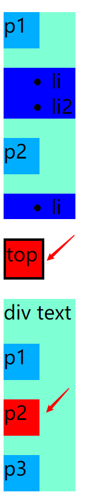

body 的第二个子元素 top ，div 的第二个子元素p2 背景为red

:nth-last-child(n)	同上，从最后一个子元素开始计数。	

```
   div p:nth-last-child(2){
        background:red;
   }
```


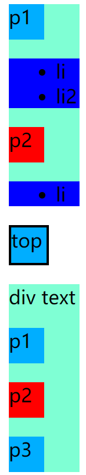

**不加前面的div 会把 body 也算上元素**


:nth-of-type(n)		选择属于其父元素第二个 <p> 元素的每个 <p> 元素。

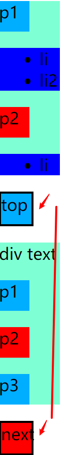

body的中的第二个<p> 元素 next , div中的第二个<p>  元素 p2


:nth-last-of-type(n)	p:nth-last-of-type(2)	同上，但是从最后一个子元素开始计数。	

**同:nth-last-child 不把body计算进去** 


:last-child	p:last-child	选择属于其父元素最后一个子元素每个 <p> 元素。	


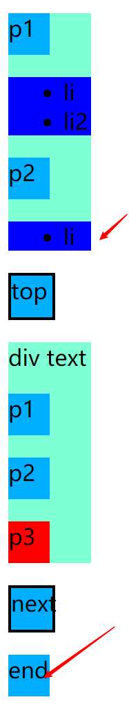

不计算body ， 父元素中最后一个元素<p>


<u><font color="#ff0000">:nth-child (an + b)</font></u>

<u><font color="#ff0000">描述：表示周期的长度，n 是计数器（从 0 开始），b 是偏移值。</font></u>

1、:nth-child(5) 选取第五个标签

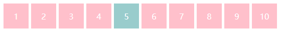

2、:nth-child(n+3) 选取大于等于3的标签

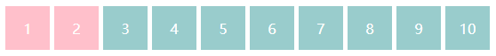

3、:nth-child(-n+3) 选取小于等于3的标签

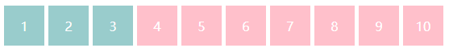

4、:nth-child(2n) 选取偶数标签，等同于:nth-child(even)

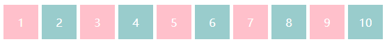

5、:nth-child(2n-1) 选取奇数标签，等同于:nth-child(odd)

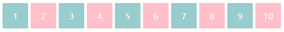

6、:nth-child(3n+1) 每隔两个元素选取一个

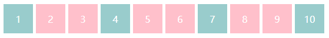

7、:last-child 选取倒数第一个

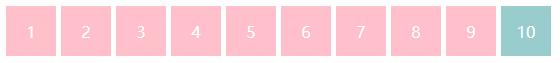

8、:nth-last-child(3) 选取倒数第三个

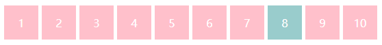


### 过渡转换 

#### transform 转换

transform 向元素应用 2D 或 3D 转换。

2D转换

- translate()    移动 (50px,100px)  X轴移动50PX , Y轴移动 100px  

  ###### 实例

  ```
  {transform:translate(50px,100px);}
  ```

- rotate()  素顺时针旋转给定的角度。允许负值，元素将**逆时针**旋转。

  ###### 实例

  ```
  div
  {
  transform: rotate(30deg);           //默认所有浏览器都支持
  -ms-transform: rotate(30deg);		/* IE 9 */
  -webkit-transform: rotate(30deg);	/* Safari and Chrome */
  -o-transform: rotate(30deg);		/* Opera */
  -moz-transform: rotate(30deg);		/* Firefox */
  }
  ```

  

- scale()

  通过 scale() 方法，元素的尺寸会增加或减少，根据给定的宽度（X 轴）和高度（Y 轴）参数：

  实例

  ```
  div{transform: scale(2,4);}   //div width:100px height:100px ==>  200px  400px
  ```

  值 scale(2,4) 把宽度转换为原始尺寸的 2 倍，把高度转换为原始高度的 4 倍。

  

- skew()

  通过 skew() 方法，元素翻转给定的角度，根据给定的水平线（X 轴）和垂直线（Y 轴）参数：

  ###### 实例

  ```
  div{transform: skew(30deg,20deg);}
  ```

  值 skew(30deg,20deg) 围绕 X 轴把元素翻转 30 度，围绕 Y 轴翻转 20 度。

- matrix()

  matrix() 方法把所有 2D 转换方法组合在一起。

  matrix() 方法需要六个参数，包含数学函数，允许您：旋转、缩放、移动以及倾斜元素。

  

  如何使用 matrix 方法将 div 元素旋转 30 度：

  ```
  div{transform:matrix(0.866,0.5,-0.5,0.866,0,0);}
  ```


transform-origin 允许你改变被转换元素的位置。

2D 转换元素能够改变元素 x 和 y 轴。3D 转换元素还能改变其 Z 轴。 x y 可以像数 也可百分比。旋转的中心点默认为div的中心，指定某个顶点 （left top） 左上角旋转。

| 值     | 描述                                                         |
| :----- | :----------------------------------------------------------- |
| x-axis | 定义视图被置于 X 轴的何处。可能的值：left center right *length**%* |
| y-axis | 定义视图被置于 Y 轴的何处。可能的值：top center bottom *length**%* |
| z-axis | 定义视图被置于 Z 轴的何处。可能的值：*length*                |

```
div{
transform: rotate(45deg);
transform-origin:20% 40%;     //默认值 50% 50% 0
}
```


transform-style 规定被嵌套元素如何在 3D 空间中显示。

```
div{
transform: rotateY(60deg); 
transform-style: preserve-3d;
}
```


perspective 规定 3D 元素的透视效果。

perspective-origin 规定 3D 元素的底部位置。

backface-visibility 定义元素在不面对屏幕时是否可见。

```
div{
transform:rotateY(180deg); //转到背面backface-visibility才有效果 
-webkit-backface-visibility:hidden; //visible
-moz-backface-visibility:hidden;
-ms-backface-visibility:hidden;
}

```

**div 旋转后180，背面 是否可见。**


#### transition 过渡

transition: all 2s 简写属性   transition: *property duration timing-function delay*; 

```
    #transition_div{
        width: 100px;
        height: 100px;
    }
    #transition_div:hover  //鼠标移动到div瞬间变成高 300px
    {
        height:300px;
    }
    <div id="transition_div"></div>
```

```
   #transition_div{
        width: 100px;
        height: 100px;
        transition:all 2s; //两秒过渡到 300px, "all" 相当于height 属性
    } 
    #transition_div:hover  
    {
        height:300px;
    }
    <div id="transition_div"></div>
```


transition-property: none|all|property 规定应用过渡的 CSS 属性的名称  width height

transition-duration: 5s 定义过渡效果花费的时间。默认是 0。

transition-timing-function: linear|ease|ease-in|ease-out|ease-in-out|cubic- bezier(n,n,n,n); 规定过渡效果的时间曲线。默认是 "ease"

| 值                            | 描述                                                         |
| :---------------------------- | :----------------------------------------------------------- |
| linear                        | 规定以相同速度开始至结束的过渡效果（等于 cubic-bezier(0,0,1,1)）。 |
| ease                          | 规定慢速开始，然后变快，然后慢速结束的过渡效果（cubic-bezier(0.25,0.1,0.25,1)）。 |
| ease-in                       | 规定以慢速开始的过渡效果（等于 cubic-bezier(0.42,0,1,1)）。  |
| ease-out                      | 规定以慢速结束的过渡效果（等于 cubic-bezier(0,0,0.58,1)）。  |
| ease-in-out                   | 规定以慢速开始和结束的过渡效果（等于 cubic-bezier(0.42,0,0.58,1)）。 |
| cubic-bezier(*n*,*n*,*n*,*n*) | 在 cubic-bezier 函数中定义自己的值。可能的值是 0 至 1 之间的数值。 |

bezier 

在animation和transition两个属性中，cubic-bezier是控制变化的速度曲线。
 `cubic-bezier(<x1>,<y1>,<x2>,<y2>)`


从上图中我们可以看到，cubic-bezier有四个点：
 两个默认的，即：P0(0,0)，P3(1,1)；
 两个控制点，即：P1(x1,y1)，P2(x2,y2) **（这是我们设置的两个点）**
 *注*：X轴的范围是0~1，超出cubic-bezier将失效，Y轴的取值没有规定，但是也不宜过大。
 我们只要调整两个控制点P1和P2的坐标，最后形成的曲线就是动画曲线。


transition-delay: 5s 规定过渡效果何时开始。默认是 0。


##### transition的局限

transition的优点在于简单易用，但是它有几个很大的局限。

（1）transition需要事件触发，所以没法在网页加载时自动发生。

（2）transition是一次性的，不能重复发生，除非一再触发。

（3）transition只能定义开始状态和结束状态，不能定义中间状态，也就是说只有两个状态。

（4）一条transition规则，只能定义一个属性的变化，不能涉及多个属性。

### 鼠标交互

:hover 选择器用于选择鼠标指针浮动在上面的元素，改选择器是CSS1

鼠标移出元素，交互效果失效。

要点:

1. 鼠标放在哪个元素上，:hover选择器前面即是该元素
2. 哪个元素的样式发生改变， :hover选择器后面就是样式改变的这个元素
3. 理清选择器前后两个的元素关系
4. 哪个元素的样式会发生改变，过渡效果就加到该元素上。


```
<style>
    * {
        margin: 0, 0;
    }

    body {
        background: #000;
    }

    .container {
        background: #eee;
    }

    .container div {
        width: 100px;
        height: 100px;
        background-color: orange;
    }
    em{
        font-size: 20px;
        font-weight: bold;
        display: inline-block;
        width: 100px;
        height: 100px;
        background: orangered;
    }
    /**
     1. 鼠标放在哪个元素上，:hover选择器前面即是该元素
     2. 哪个元素的样式发生改变， :hover选择器后面就是样式改变的这个元素
     */
     .container:hover span{
         font-size: 24px;
     }
     /**
       鼠标放在container 下的子div上时， 设置邻近的P标签字体大小20px. 字体颜色红色 
       设置i 标签钉钉字体样式为 normal,字体大小为36px;

     */
     .container>div:hover +p{
         font-size: 20px;
         color: red;

     }
     .container>div:hover ~i{
         font-style: normal;
         font-size: 36px;
         
     }
</style>

<body>
    <div class="container">
        <div>
            div标签
            <br>
            <span>span</span>
        </div>
        <p>p标签</p>
        <em>em标签</em>
        <i>i标签</i>

    </div>
</body>
```


### 动画

#### animation

CSS Animation需要指定动画一个周期持续的时间，以及动画效果的名称.

鼠标移动上去执行效果:

```
.container div:hover{
        animation: 1s colortrans; /* 持续时间为1秒 rainbow 效果 ,循环一次*/
}

/** colortrans 效果一共有三个状态，分别为起始（0%）、中点（50%）和结束（100%）*/
@keyframes colortrans {
  0% { background: #c00; }
  50% { background: orange; }
  100% { background: yellowgreen; }
}
```

循环次数 n  、infinite， n 位数字，  infinite 无限循环

```
animation: 1s colortrans  infinite ;
```

#### animation-fill-mode

| 值        | 描述                                                         |
| :-------- | :----------------------------------------------------------- |
| none      | 默认值。动画在动画执行之前和之后不会应用任何样式到目标元素。 |
| forwards  | 在动画结束后（由 animation-iteration-count 决定），动画将应用该属性值。 |
| backwards | 动画将应用在 animation-delay 定义期间启动动画的第一次迭代的关键帧中定义的属性值。这些都是 from 关键帧中的值（当 animation-direction 为 "normal" 或 "alternate" 时）或 to 关键帧中的值（当 animation-direction 为 "reverse" 或 "alternate-reverse" 时）。 |
| both      | 动画遵循 forwards 和 backwards 的规则。也就是说，动画会在两个方向上扩展动画属性。 |
| initial   | 设置该属性为它的默认值。                                     |
| inherit   | 从父元素继承该属性。                                         |

```
animation:  colortrans  1s forwards;
```

#### animation-direction

normal 、alternate、reverse、alternate-reverse

#### animation的各项属性

同transition一样，animation也是一个简写形式。

```css
div:hover {
   animation: 1s 1s  xxanimation linear 3 forwards normal;
 }
```

这是一个简写形式，可以分解成各个单独的属性。

 ```css
 div:hover {
   animation-name: xxanimation;
   animation-duration: 1s;
   animation-timing-function: linear;
   animation-delay: 1s;
   animation-fill-mode:forwards;
   animation-direction: normal;
   animation-iteration-count: 3;
 }
 ```

#### keyframes的写法

keyframes关键字用来定义动画的各个状态，它的写法相当自由。

```css
@keyframes rainbow {
  0% { background: #c00 }
  50% { background: orange }
  100% { background: yellowgreen }
}
```

0%可以用from代表，100%可以用to代表，因此上面的代码等同于下面的形式。

```css
@keyframes rainbow {
  from { background: #c00 }
  50% { background: orange }
  to { background: yellowgreen }
}
```

如果省略某个状态，浏览器会自动推算中间状态，所以下面都是合法的写法。

```css
@keyframes rainbow {
  50% { background: orange }
  to { background: yellowgreen }
}

@keyframes rainbow {
  to { background: yellowgreen }
}
```

甚至，可以把多个状态写在一行。

```css
@keyframes pound {
  from，to { transform: none; }
  50% { transform: scale(1.2); }
}
```

另外一点需要注意的是，浏览器从一个状态向另一个状态过渡，是平滑过渡。steps函数可以实现分步过渡。

```css
div:hover {
  animation: 1s rainbow infinite steps(10);
}
```


### before &after 伪元素

#### 什么是伪元素？

不会出现在DOM中，不会改变文档内容，仅仅是在CSS渲染时加入，不可复制的元素。

#### 常用伪元素：

::first-letter, ::first-line,::before,::after,::selection

::before 伪元素用于在元素之前添加内容

::after 伪元素用于在元素之后添加内容

#### 重要属性 content

content的值  "" 、字符串、attr() 、url() 、uri() 、counter()等

##### 空值"" 

扩展背景、清除浮动

```css
.clearFix::after{
    clear:both;
    content:"";
    display:block;
    height:0;
    overflow:hidden;
}
```

##### 字符串

```css
.phoneNo::before{
         content: '\260e';
         font-size: 16px;
 }
     
```

```
<p class="phoneNo">17788555831</p>
```


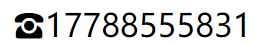

##### attr() 以及 url()

attr() 可以调用当前元素的某个属性

url() 可以应用媒体文件 （图片），content 图片不能设置大小可以用 backgroud 代替

```css
 a::before{
   content: url("//www.baidu.com/img/flexible/logo/pc/result@2.png") ;   
 }
  a::after{
      content: attr(href);
 }
```

```
<a href="http://baidu.com">before </a>
```

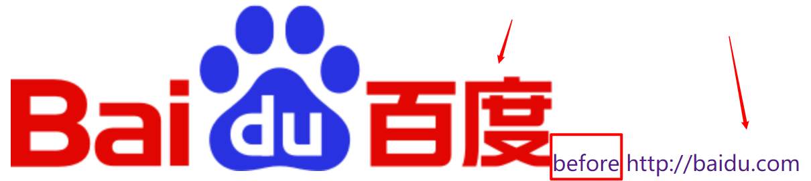

#### counter 计数器

counter 调用计数器，可以不使用列表元素序号功能。

counter 要配合 counter-increment 和counter-reset 属性使用

counter-reset 给同级元素增加计数器 比如一个要么有多个H1元素 ，那就给body加计数器。

一个H1元素里面有多个H2 元素，那就给H1 元素加计数器。

counter-increment 增加计数器值。

```css
body {
        counter-reset: section;
    }

    h1 {
        counter-reset: subsection;
    }

    h1:before {
        counter-increment: section;
        content: "Section "counter(section) ". ";
    }

    h2:before {
        counter-increment: subsection;
        content: counter(section) "."counter(subsection) " ";
    }
    
    
    <body>
    <h1>h1</h1>
    <h2> h2</h2>
    <h2>h2 1</h2>
    <h2>h2 2</h2>
    <br>
    <h1>h2</h1>
    <h2> h2 2</h2>
    <h2>h2 2 1</h2>
    <h2>h2 2 2</h2>
</body>
```


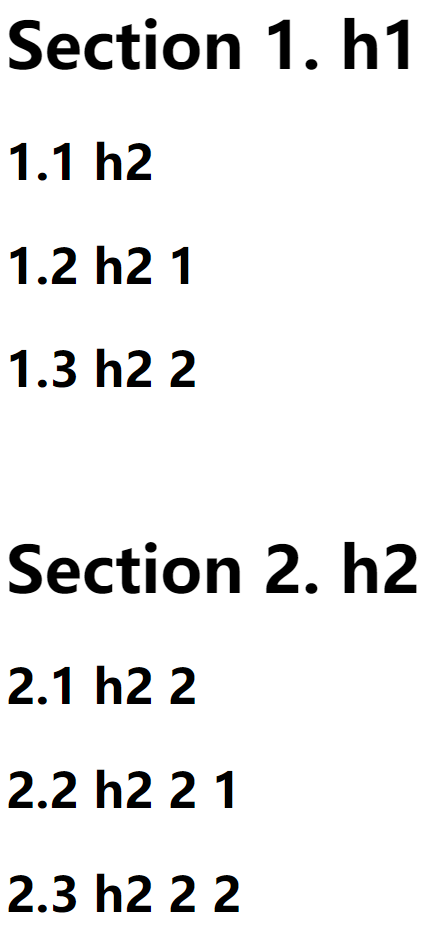

### 边框

l border-radius

border-radius:25px;   //半径   

-moz-border-radius:25px; /* Old Firefox */

 

l box-shadow

-moz-box-shadow: 10px 10px 5px #888888; /* 老的 Firefox */

box-shadow: 10px 10px 5px #888888;   // x 偏移， y偏移 ，模糊像数

l border-image

 

round 围绕

border-image:url(border.png) 30 30 round;

-moz-border-image:url(border.png) 30 30 round; /* 老的 Firefox */

-webkit-border-image:url(border.png) 30 30 round; /* Safari 和 Chrome */

-o-border-image:url(border.png) 30 30 round; /* Opera */


\#stretch 定位四角拉伸

{

-moz-border-image:url(/i/border.png) 30 30 stretch;  /* Old Firefox */

-webkit-border-image:url(/i/border.png) 30 30 stretch;    /* Safari and Chrome */

-o-border-image:url(/i/border.png) 30 30 stretch;     /* Opera */

border-image:url(/i/border.png) 30 30 stretch;

}

 

 

 

文字

h1{text-shadow: 5px 5px 5px #FF0000;} x 轴 y 轴  模糊 颜色

允许对长单词进行拆分，并换行到下一行：

p {word-wrap:break-word;}

 

 

使用字体

<style> 

@font-face{

font-family: myFirstFont;

src: url('Sansation_Light.ttf'),

   url('Sansation_Light.eot'); /* IE9+ */

}

div{font-family:myFirstFont;}

</style>

### 渐变

CSS3 渐变（gradients）可以让你在两个或多个指定的颜色之间显示平稳的过渡。


```
background-image: linear-gradient(direction, color-stop1, color-stop2, ...);
```

direction 角度

#####  **从上到下**

```css 
#grad {    background-image: linear-gradient(#e66465, #9198e5); }
```

##### **从左到右**

```css
#grad {
  height: 200px;
  background-image: linear-gradient(to right, red , yellow);
}
```

##### 对角

```css
#grad {
  height: 200px;
  background-image: linear-gradient(to bottom right, red, yellow);
}
```


```CSS
.gradient{
    position: absolute;
    width: 300px;
    height: 200px;
    left: 50%;
    top: 50%;
    background-image:linear-gradient(141deg,#9fb8ad 0%,#1fc8db 51%,#2cb5e8 75%)
}

 <div class="gradient">
     渐变
  </div>
```


综合例子 流光按钮：

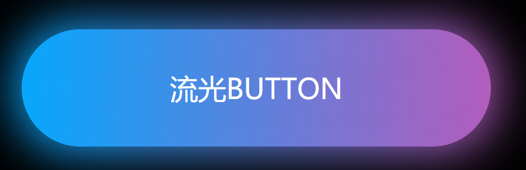

```
<style>
    * {
        margin: 0, 0;
    }

    body {
        background: #000;
    }

    a {
        /*去掉下划线*/
        text-decoration: none;
        /* 绝对定位居中*/
        position: absolute;
        left: 50%;
        top: 50%;
        transform: translate(-50%, -50%);
        /*字体*/
        font-size: 24px;
        /*背景 放大4倍*/
        background: linear-gradient(90deg, #03a9fe, #f441a5, #ffeb3b, #03a9f4);
        background-size: 400%;
        width: 400px;
        height: 100px;
        color: #fff;
        /*文字居中*/
        line-height: 100px;
        text-align: center;
        text-transform: uppercase;
        /*圆角*/
        border-radius: 50px;
        z-index: 1;
    }

    /**发光图层*/
    a::before {
        content: "";
        position: absolute;
        left: -5px;
        top: -5px;
        right: -5px;
        bottom: -5px;
        background: linear-gradient(90deg, #03a9fe, #f441a5, #ffeb3b, #03a9f4);
        background-size: 400%;
        border-radius: 50px;
        filter: blur(20px);
        z-index: -1;
    }

    a:hover::before {
        animation: streamer 8s infinite;
    }

    a:hover {
        animation: streamer 8s infinite;
    }

    @keyframes streamer {
        100% {
            /*上面设置的 backgroud size*/
            background-position: -400% 0;
        }

    }
</style>

  <a href="javascript:#">流光button</a>

```


### 弹性盒子模型

布局的传统解决方案，基于盒状模型，依赖display 属性+ position 属性+ float属性。

它对于那些特殊布局非常不方便 垂直居中等。


 Flex 简便 、完整 、响应式 实现各种页面布局。

 Flex是Flexible Box的缩写，意为"弹性布局"，用来为盒状模型提供最大的灵活性。设为Flex布局以后，子元素的float、clear和vertical-align属性将失效。

 Flex 是 flex-grow、flex-shrink、flex-basis的缩写。

特点：

1. 元素容器没有足够的空间，无需计算自动设置同意行、同列。
2. 容易在容器内左、中、右对齐。 
3. 无需修改结构可以可以改变显示顺序。
4. 容器设置百分比视窗改变大小，子元素自动分配宽度或高度比例。


容器属性：

#### display ：flex / inline-flex


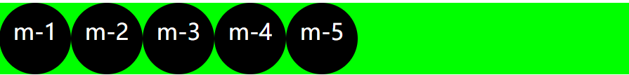

flex ：box2 不随着子元素变化 100% 撑满屏幕 

```css
   .box2{
      background-color: #0f0;
      display:inline-flex;
      /*没有为父元素box2设置宽度，但是父元素默认会根据子元素的宽高去自适应*/
    }   

   <div class="box2">
         <div class="item">m-1</div>
        <div class="item">m-2</div>
        <div class="item">m-3</div>
        <div class="item">m-4</div>
        <div class="item">m-5</div>
    </div> 
```

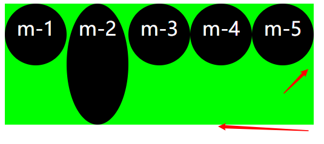

inline-flex ：box2 随着 m-1 ... m-5 的宽高自适应

#### flex - direction 指向主轴方向

```
 .step1{
        display: flex;
   /* 
        flex-direction:row;  //不设置 默认
        flex-direction:row-reverse;
        flex-direction: column;
        flex-direction: column-reverse;
     */
 }
```

row :子元素排成一行


row-reverse ：子元素倒序排成一行

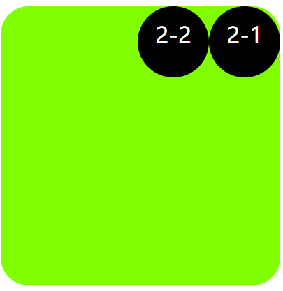

column：子元素排成一列

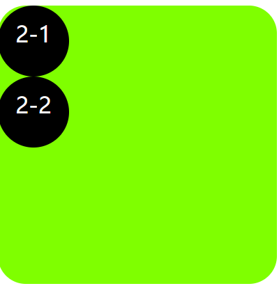

column-reverse ：子元素倒序排成一列

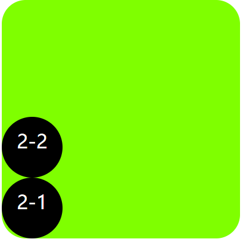

#### flexbox 对齐

 justify-content: flex-start | flex-end |**center |space -between |space-around**

**center 、space -between、space-around**使用广泛

```css
   .step3{
        display: flex;
        /* justify-content:flex-start; */
        /* justify-content:flex-end; */
        /* justify-content:center; */
        /* justify-content:space-around; */
        /* justify-content:space-between; */

    }
```


flex-start:  子元素在容器中左对齐 默认

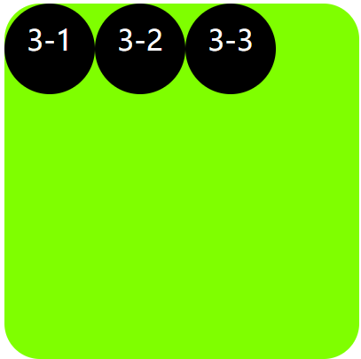

flex-end: 子元素在容器中右对齐

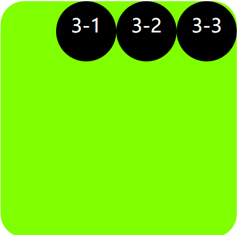

center: 子元素聚集在中间排列

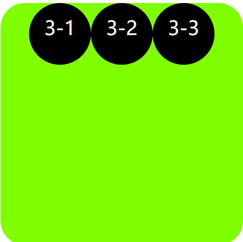

space-between: 两个元素有间隔排列，撑满容器

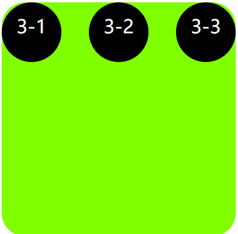

space-around: 每个子元素间隔间距左右16px，包括容器

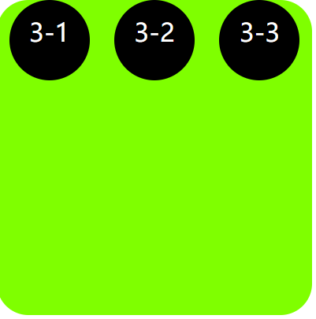


#### flex-wrap 换行

flex-wrap:nowrap | wrap | wrap-reverse;

在一行或一列排不下，是否允许换行

nowrap:(默认显示)  单行显示

wrap: 多行显示，子元素会溢出容器

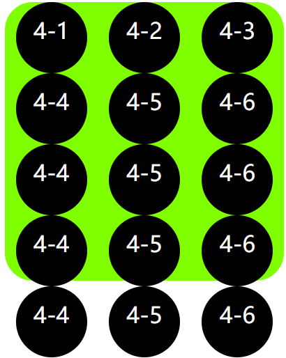

```css
   .step4{
        display: flex;
        justify-content:space-around;
        flex-wrap: wrap;
    }

```

wrap-reverse:多行 反顺序排列


#### align-items :交叉轴对齐方式

align-items: flex-start |flex-end| center | basline | stretch

```html
 .step5{
        display: flex;
        justify-content:space-around;
        /* align-items: flex-start;
        align-items: flex-end; */
        align-items: center;
        /* align-items:baseline; */
        /* align-items: stretch ; */
    }
    
     <div class="box step5">
        <div class="item">5-1</div>
        <div class="item" style="height: 80px; width: 80px; line-height: normal;">5-2</div>
        <div class="item" style="height: auto;">5-3</div>
    </div>
```


flex-start 交叉轴起点对齐，默认左上对齐

flex-end 交叉轴终点对齐 ，左下角对齐

center 交叉轴中点对齐，容器垂直居中对齐

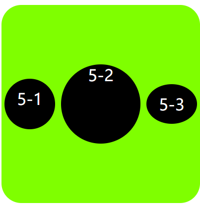

baseline 项目第一行文字的基线对齐

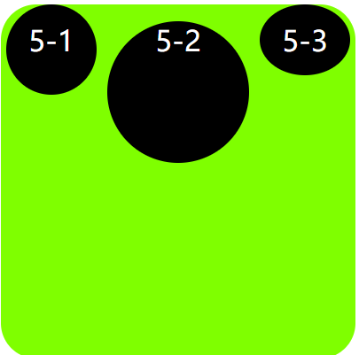

stretch  默认 如果项目未设置高度或设置为auth  ，将占满整个容器

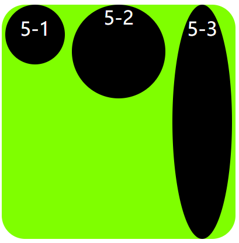


#### align-self 属性

align-self: auto|stretch|center|flex-start|flex-end|baseline|initial|inherit;

## 属性值

| 值         | 描述                                                         |      |
| :--------- | :----------------------------------------------------------- | :--- |
| auto       | 默认值。元素继承了它的父容器的 align-items 属性。如果没有父容器则为 "stretch"。 |      |
| stretch    | 元素被拉伸以适应容器。                                       |      |
| center     | 元素位于容器的中心。                                         |      |
| flex-start | 元素位于容器的开头。                                         |      |
| flex-end   | 元素位于容器的结尾。                                         |      |
| baseline   | 元素位于容器的基线上。                                       |      |
| initial    | 设置该属性为它的默认值。                                     |      |
| inherit    | 从父元素继承该属性。                                         |      |

 **align-self: center;** 

```html
    <div class="box step6">
        <div class="item step6item">6-1</div>
    </div>
```

```css
 .box {
        margin: 100px;
        float: left;
        width: 200px;
        height: 200px;
        border-radius: 20px;
        background-color: chartreuse;

    }
    // 也可定义在item 上
    .item {
        background-color: #000;
        width: 51px;
        height: 51px;
        border-radius: 50%;
        color: #fff;
        text-align: center;
        font-size: 16px;
        line-height: 40px;
    }
    
  .step6{
        display: flex;
        align-self: center; //item不继承父元素的样式,无效
        justify-content:space-around;
        flex-wrap: wrap;

    }
    .step6item{
        align-self: center; //必须定义在子元素中
    }
```

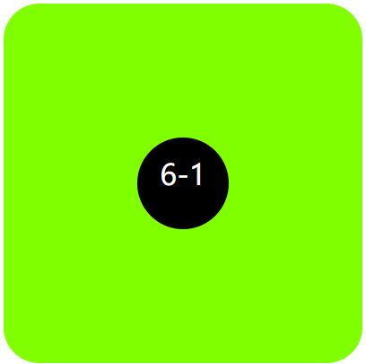


